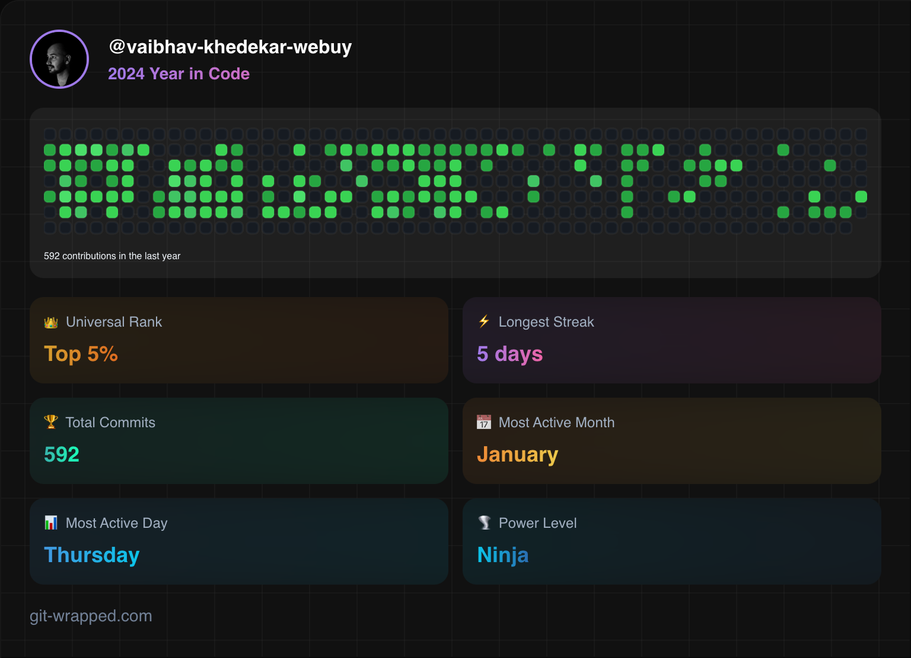

    

    <a href="https://www.linkedin.com/in/vkhedekar">LinkedIn</a> | <a href="https://twitter.com/vvkhedekar">X</a> | <a href="https://www.instagram.com/vaibhav.khedekar">Instagram</a> | <a href="https://orcid.org/0009-0000-4578-1267">ORCID</a>

OR

Drop me Mail on <a href="mailto:contact@vaibhavkhedekar.com">contact@vaibhavkhedekar.com</a>
    | Write message <a href="http://vaibhavkhedekar.com/contact">here</a>

 

    
    
    
    

 

    

 

 

    

